  

# 📌목차

1. [서비스 소개](#서비스-소개)
2. [팀 구성](#팀-구성)
3. [주요 기능](#주요-기능)
4. [주요 기술](#주요-기술)
5. [프로젝트 산출물](#프로젝트-산출물) (최종발표자료, 아키텍쳐, 디자인, 요구사항 명세서, ERD, API 명세서)

# **🌱서비스 소개**

### **⌛프로젝트 기간**

**2025.04.14  ~ 2025.05.22 (6주)**

## 📖 개요

**SSAFY 12기 2학기 자율 프로젝트 - 기업연계**

> 본 프로젝트는 **교통약자 빅데이터 솔루션 기업 [윌체어(WillChair)], [양산시 웅상종합사회복지관]** 과 연계하여 진행되었으며,
> 
> 청년 복지 사각지대 해소를 위한 프로젝트 입니다.

</aside>

**다시 빛 / 디어리**는 고립·은둔 청년 문제를 해결하기 위해 기획된 **데이터 기반 통합 관리 플랫폼**입니다.

- **다시 빛**: 지자체 및 기관을 위한 **시군구·행정동 단위 대시보드**로, 청년 인구 분포와 고립 지표, 홍보물 및 협력기관 현황, 상담 데이터 등을 **지도·차트 기반으로 시각화**하여 정책적 개입을 지원합니다.
- **디어리**: 고립 청년 본인을 위한 **자가관리 어플리케이션**으로, 감정 일기와 미션 기록을 통해 **AI 기반 감정 피드백, 감정 점수 산정**, 맞춤형 회복 행동 추천 및 주간 리포트를 제공합니다.
    
최근 심각한 사회문제로 대두되고 있는 **은둔·고립 청년 문제**에 대해, 본 서비스는 **데이터 기반 조기 발굴 → 개입 → 자가 회복 → 재고립 방지**까지 이어지는 **전주기적 복지 개입 체계**를 구축함으로써, **실질적 사회적 효과와 행정 효율성**을 함께 기대할 수 있습니다.

> **"정성 데이터를 정량화하고, 감정 기록을 회복의 시작점으로."**
>
> 다시 빛과 디어리는 청년 복지의 새로운 패러다임을 제안합니다.

# 👥팀 구성

### 권유주(BE, Infra)

- 협력기관 대시보드 RESTful API 개발
- GPT 기반 AI 주간 리포트 RESTful API 개발
- PWA 프론트엔드 초기 세팅
- 주간 리포트 프론트엔드 개발
- Docker 및 Certbot 기반 HTTPS 인프라 구축

### 김도원(BE, Infra)

- Docker 컨테이너 및 Nginx관련 인프라 구축
- 젠킨스 활용 자동화 배포
- REST API 설계 및 구현
- DB 설계 및 구현

### 김민수(FE)

- Zustand Store 활용한 전역상태관리 시스템 구축
- 네이버 지도 API, 지역 구분 GeoJson 데이터 활용 지도 컴포넌트 구현
- rechart 통한 통계 데이터 시각화
- 반응형 UI/UX 설계 및 구현
- RESTful API 연동 및 데이터 처리 로직 구현

### 문영민(BE, Infra)

- 젠킨스 활용 자동화 배포
- 도커 컨테이너 활용
- 미션 조회와 수행 API, 프론트 개발
- 대시보드 API 개발

### 조원주(BE, AI)

- Yolo를 통한 이미지에서 객체 감지 기능 개발
- xlsx, csv 파일을 통한 DB 자동화
- 카카오 API와 AI를 통한 미션 검증 개발
- 청년 상담 관련 REST API 구현

### 조희진(BE)

- 사용자 인증 로직
- 설문 관련 API 구현 (앱/대시보드)
- 설문 데이터 연동
- 음성을 통한 상담일지 자동 작성 기능

# 🚀주요 기능

### 🖥️ 다시 빛

📊 데이터 시각화 대시보드

- **청년 인구 분포 비율 대시보드**  
  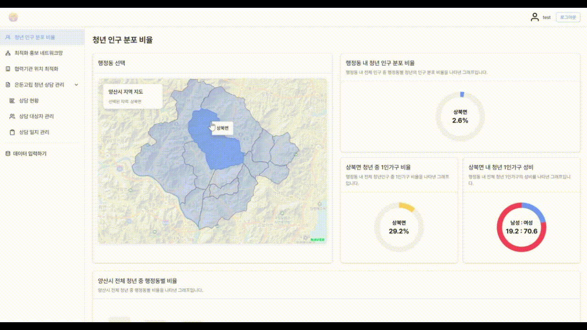  
  → 각 행정동별 청년 인구 분포 비율 관련 정보를 시각화 하여 조회합니다.

- **최적화 홍보 네트워크망 대시보드**  
  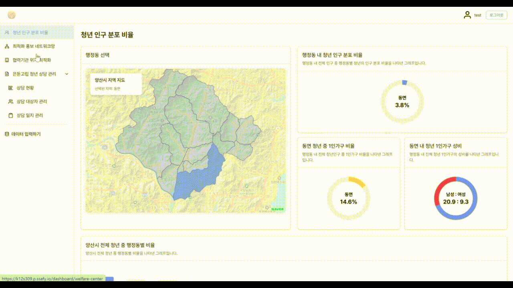  
  → 각 행정동별 홍보물 관련 정보를 시각화 하여 조회합니다.

- **협력기관 위치 최적화 대시보드**  
  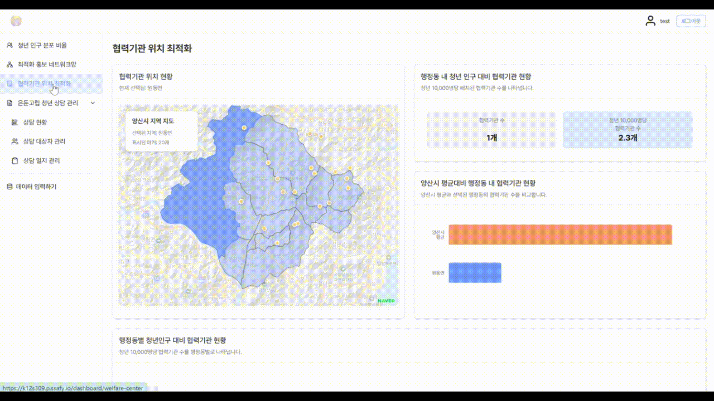  
  → 각 행정동별 협력기관 관련 정보를 시각화 하여 조회합니다.

- **대시보드 데이터 수정 및 입력**  
  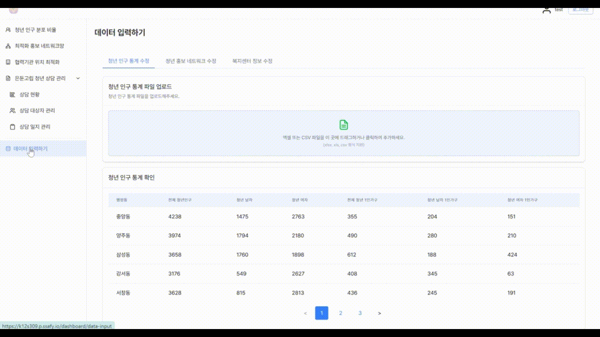  
  → 관리자가 엑셀 파일을 이용하여 데이터를 입력하거나 수정할 수 있습니다.

🗂️ 은둔 고립 청년 상담 관리

- **상담 현황 대시보드**  
  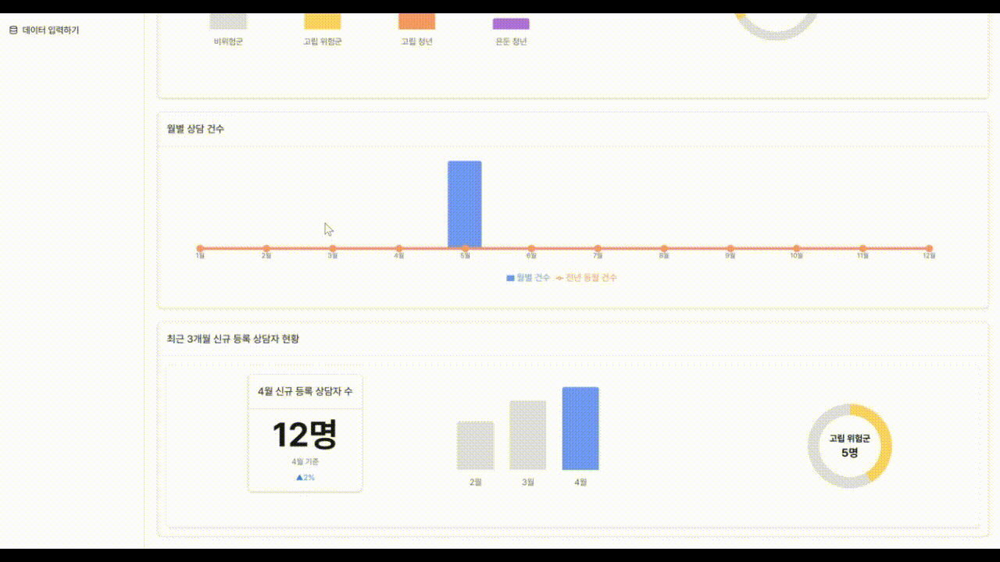  
  → 누적 상담 인원에 대한 데이터를 조회할 수 있습니다.

- **상담 대상자 관리**  
  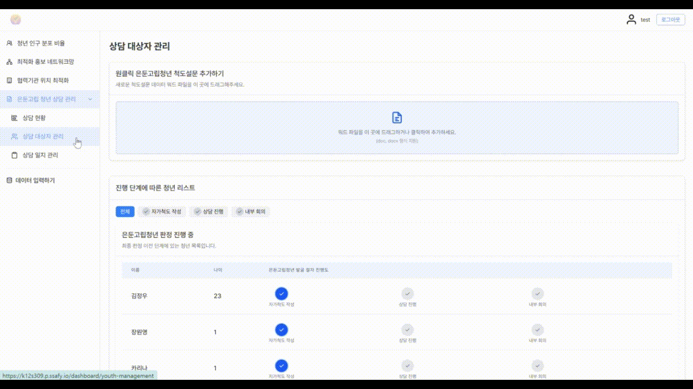  
  → 은둔/고립 청년 선발 단계 및 척도 설문을 확인하고 관리할 수 있습니다.

- **상담 일정 관리**  
  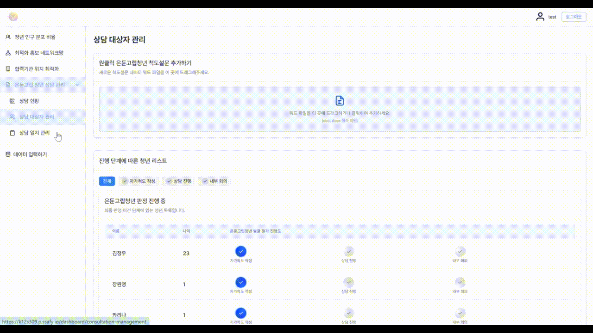  
  → 캘린더 기반 상담 일정 조회 및 수정

- **상담 일정 추가**  
  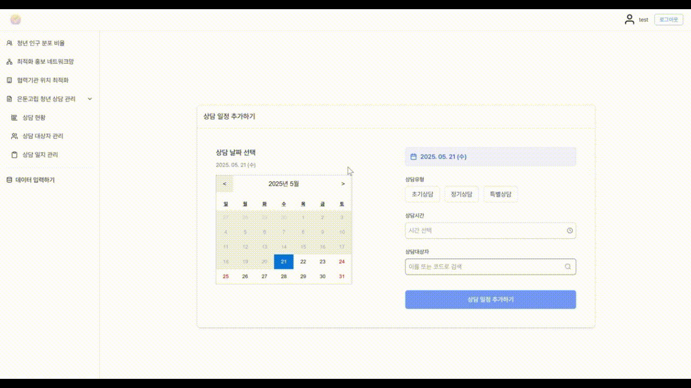  
  → 새로운 상담 일정을 추가할 수 있습니다.

- **상담 일지 관리**  
  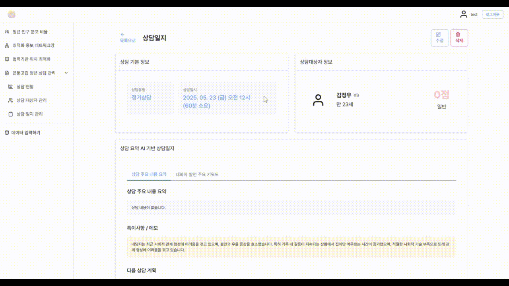  
  → 상담에 대한 일지 내용 열람

- **상담 일지 작성 (음성 기반)**  
  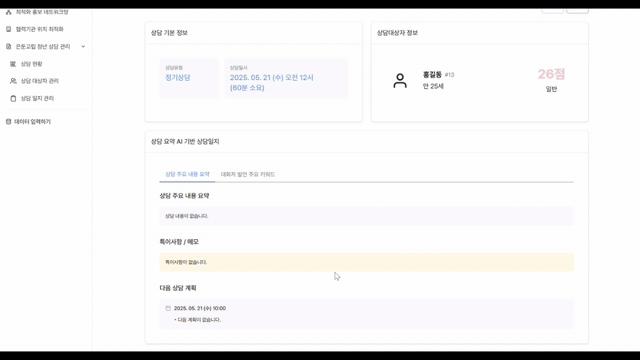  
  → 오디오 파일 업로드 기반으로 상담 일지 작성 가능

### 📓 Dearie

🎯 데일리 미션

- **데일리 미션 조회**  
    
  → 매일 새롭게 제공되는 데일리 미션을 확인할 수 있습니다.

- **글쓰기 미션**  
  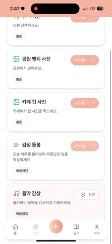  
  → 해당 문항에 대한 짧은 답변을 입력하여 미션을 완료할 수 있습니다.

- **노래 미션**  
  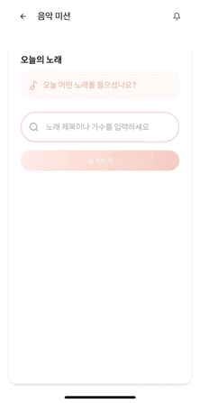  
  → 오늘 들었던 노래를 입력하여 미션을 완료할 수 있습니다.

- **산책 미션**  
    
  → 산책 과정을 기록해 경로를 저장할 수 있습니다.

- **물체 인식 미션**  
    
  → 위/경도 기반 위치 비교 후 컵 사진 업로드로 미션 완료

📘 일기

- **일기 작성**  
    
  → 일기를 작성하고, AI의 코멘트를 확인할 수 있습니다.

- **일기 조회**  
  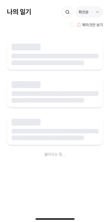  
  → 북마크/정렬/검색 기능을 활용한 일기 관리

📊 감정 분석 리포트

- **감정 분석 리포트 조회**  
  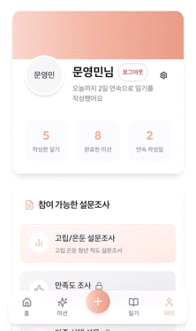  
  → 최근 일기 내용을 바탕으로 감정 점수화 및 회복 미션 추천

📝 설문조사 진행

- **자가 척도 설문**  
    
  → 고립/은둔 위험도 측정을 위한 설문 진행 후 상담 연계

## 🛠️ 주요 기술

### **Back-End**

- **Spring Boot 3.4.5 (Java 21)**
    - RESTful API 서버 개발
    - Spring MVC 기반 계층 구조 설계 (Controller - Service - Repository)
    - 디어리와 다시빛 서비스를 **도메인 단위로 분리**하여, 각각의 컨트롤러/서비스/레포지토리를 독립적으로 관리.
    - @Transactional을 활용한 트랜잭션 처리
- **Spring Data JPA**
    - PostgreSQL 기반 데이터 처리
    - Entity 매핑 및 복잡한 쿼리는 QueryDSL 또는 JPQL로 구현
    - 페이징 처리 (Pageable) 및 동적 조건 검색 구현
- **PostgreSQL**
    - 모든 핵심 데이터 저장: 유저, 상담 로그, 감정 리포트, 미션 상태 등
    - JPA 기반으로 엔티티 간 관계를 명확히 설계 → 무결성 유지
- **데이터 업로드 처리**
    - **Apache POI (XSSF)**: .xlsx , .docx 기반 행정청 데이터 업로드
    - **OpenCSV**: .csv 형식 지원 → Spring에서 자동 파싱 후 DTO 매핑 및 정합성 검증
- **파일 업로드 (Multipart 처리)**
    - 상담 음성, 활동 인증 이미지, 엑셀 리포트 등 **모든 미디어 업로드는 MultipartResolver를 통해 처리**.
    - S3에 저장된 후 URL을 DB에 저장하여 접근 관리.
- **Spring Security + JWT (jjwt)**
    - 로그인 유저 인증을 위한 JWT 기반 인증/인가 구현.
    - 사용자 ID 추출을 통해 요청자 정보 기반의 데이터 필터링
- **Validation 및 예외 처리**
    - Spring @Valid, @Validated를 활용한 입력값 검증
    - Global Exception Handler를 통해 통합 에러 응답 포맷 구성
- **Flyway**
    - MySQL 마이그레이션 툴로 스키마 및 초기 데이터 관리
- **Swagger (Springdoc OpenAPI)**
    - REST API 문서 자동 생성
    - 테스트 가능한 인터페이스 제공
- **Kafka 기반 분산 환경 데이터 전송 지원**
    - 앱에서 설문을 진행하고 전송을 하게 되면, 자동으로 이를 대시보드에 저장됨
- **이미지 검증 서비스**
    - ImageVerifier 인터페이스를 중심으로, **미션 유형별 검증 로직 구성**
        - FlowerImageVerifier, CafeImageVerifier, ParkImageVerifier, WalkImageVerifier 등으로 분리
    - ImageVerificationService에서 요청 이미지에 대해 YOLO 기반 객체 감지 수행
- **위치 기반 장소 검증**
    - GeoSearchService 구현을 통해 사용자 GPS 좌표 기반으로 카카오 지역 검색 API 호출

### **Front-End**

- **Next.js 15 (with TypeScript)**
    - App Router 기반 프로젝트 구조
    - SSR 및 SSG 혼합으로 빠른 렌더링과 SEO 대응.
    - 디어리, 다시빛 각기 다른 UI/UX 흐름을 라우팅 구조로 분리.
- **Tailwind CSS + Radix UI**
    - 유틸리티 기반 CSS 프레임워크 사용
    - Radix UI를 활용해 모달, 알림창, 입력폼 등 고급 UI 컴포넌트를 일관되게 사용.
- **Axios + Interceptor**
    - API 통신 라이브러리로 axios 사용
    - JWT 토큰을 자동으로 헤더에 포함시키는 interceptor 설정
    - **AccessToken 만료 시 자동 로그아웃 처리 및 로그인 페이지로 리디렉션**
    - 서버로부터의 인증 실패(401) 응답 시 모달 또는 토스트 메시지로 사용자에게 안내
- **Responsive / Mobile UI**
    - 모바일 환경 최적화
    - 카카오톡 친구에게 선물 전송 등의 UX 흐름 고려
- **이미지 최적화**
    - next/image를 활용하여 자동 이미지 크기 조절 및 lazy loading 처리
    - blurDataURL 및 placeholder를 통해 UX 향상
- **에러 처리 및 사용자 피드백**
    - 요청 실패 시 토스트 / 모달을 통한 사용자 피드백 제공
    - 예외 상황에서도 앱이 중단되지 않도록 방어 로직 구현

### AI

- **GPT API (감정 분석 및 피드백 생성)**
    - 일기 내용, 활동 기록 등을 기반으로 **감정 코멘트 및 주간 리포트 자동 생성**.
    - 사전 정의된 템플릿을 기반으로 감정 키워드에 따른 추천 문구 제공.
- **Whisper (음성 전사)**
    - 상담 음성을 업로드하면 **Whisper로 텍스트 전사 → GPT로 요약 생성**.
    - 상담자가 별도 수기 작성 없이 대시보드에서 요약 내용을 바로 확인 가능
- **YOLOv8 + OpenCV**
    - 미션 인증 사진을 분석하여, 특정 객체(예: 인물, 거리, 실외 환경 등) 존재 여부 확인.
    - 예: '산책' 미션일 경우 사람 + 도로 감지 시 성공 처리.

### 외부 API

- **Mapbox**
- **Naver / Kakao 지도 API**
- **Itunes**

### **Infra(CI/CD)**

- **파이프 라인**
    - Pipeline(Nginx): 쉽게 nginx 컨테이너를 생성하고 관리하기 위해 파이프 라인을 사용했습니다.
    - Pipeline(DB): 쉽게 DB(mongo, MySQL, ipfs) 컨테이너를 생성하고 관리하기 위해 파이프 라인을 사용했습니다.

| 구성 요소 | 설명 |
| --- | --- |
| **GitLab** | 소스코드 저장소 / Webhook으로 Jenkins 트리거 |
| **Jenkins (Docker)** | Multi-branch pipeline CI/CD 관리 (브랜치 별 자동 빌드) |
| **Nginx (Docker)** | 리버스 프록시, SSL 인증서 적용 (Let's Encrypt) |
| **Backend-lightreborn (Spring Boot)** | Java 21 / Flyway 기반 마이그레이션 / MySQL 사용 |
| **Backend-dearie (Spring Boot)** | Java 21 / Flyway 기반 마이그레이션 / MySQL 사용 |
| **Frontend-lightreborn (Next.js)** | 프론트 서비스 (user-facing) |
| **Frontend-lightreborn (Next.js)** | 프론트 서비스 (user-facing) |
| **PostgreSQL (Docker)** | 애플리케이션 DB 구성 |
| **Flyway** | 마이그레이션 자동화 (.sql 실행) |
| **Mattermost** | CI/CD 알림 전달용 (Webhook) |

### **협업 툴**

- **GitLab**
    - 프로젝트의 코드 및 문서를 관리하고, **Git Flow 전략**을 기반으로 효율적인 버전 관리와 협업을 수행
- **Jira**
    - 프로젝트 일정, 이슈 및 작업 관리
- **Mattermost**
    - 팀 내 의사소통 및 파일 공유를 지원하는 협업 도구 활용
- **Figma**
    - 프로젝트의 UI/UX 설계 및 디자인 가이드라인 구축에 활용
    - 팀원 간의 효과적인 디자인 커뮤니케이션 및 일관성 있는 디자인 유지
- **Scrum (Agile)**
    - 1주 주기의 프로젝트 스프린트와 매일 5분의 스크럼미팅을 통한 통한 긴밀한 팀 협업과 소통

# 📜프로젝트 산출물

### 1. 최종 발표 자료

- [PPT링크](https://www.canva.com/design/DAGoCQK4exo/nVrqjsuwOsf6rZANc9aOHA/edit)

### 2. 와이어 프레임

- **다시 빛(대시보드)**  
  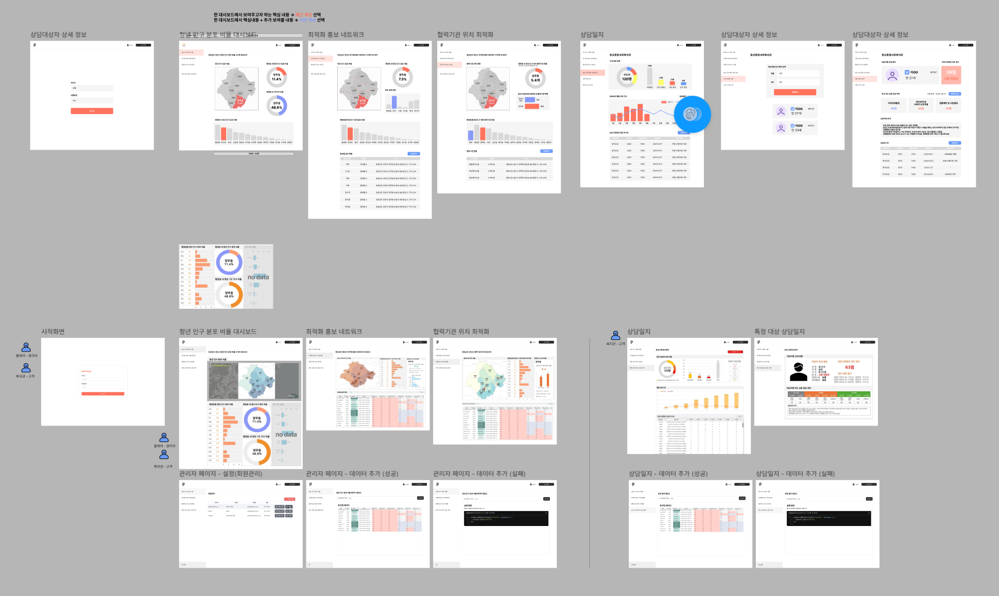

- **디어리(미션/ 일기 기반 자기관리 서비스)**  
  

---

### 3. 아키텍처  
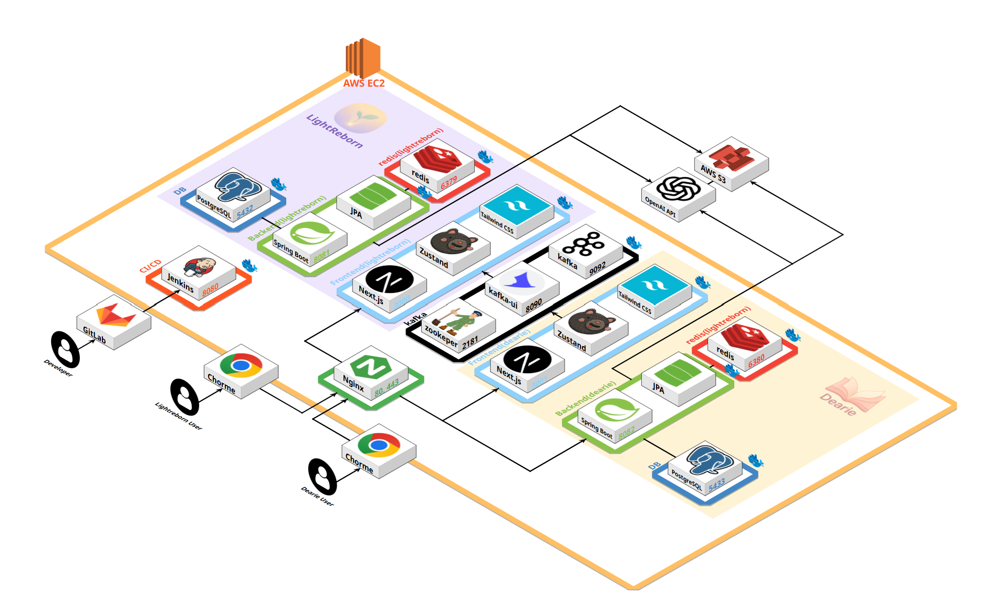

---

### 4. ERD

- **다시 빛**  
  

- **디어리**  
  

---

### 5. API 명세서

- **다시 빛**  
  
  
  
  
  
  
  
  
  
  
  
  
  
  

- **디어리**  
  
  
  
  
  
  
  
  

